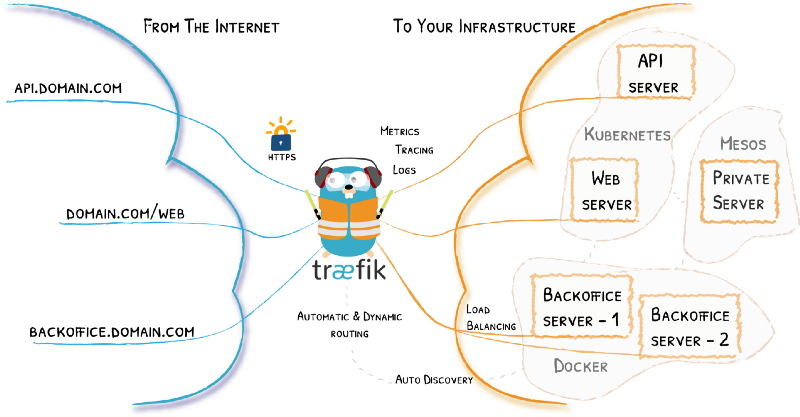

[Image Source](https://docs.traefik.io/assets/img/traefik-architecture.png)

## Introduction

In this tutorial we will go trough the following things:

1. Setup and configure Traefik in a Docker container
2. Let's Encrypt setup for automatic HTTPS certificates
3. Deploy a simple service (Portainer) and expose it to the internet

You will find all the required configuration files in our [Git repository](https://github.com/containeroo/traefik-simple).

## Prerequisites

In order to follow along, you need these things:

- Docker (obviously)
- Docker Compose
- A domain
- Ports 80 and 443 forwarded to your Docker host

## Setup and configure Traefik with Let's Encrypt

Let's get started by setting up Traefik.

First, create a directory for our containers:

```bash
mkdir -p /opt/containers/{traefik,portainer}
```

Create the data folder and config files for Traefik:

```bash
mkdir -p /opt/containers/traefik/data
touch /opt/containers/traefik/data/acme.json
chmod 600 /opt/containers/traefik/data/acme.json
touch /opt/containers/traefik/data/traefik.yml
```

The `acme.json` file is the storage file for the HTTPS certificates.

Now we create the basic Traefik configuration file (`/opt/containers/traefik/data/traefik.yml`):

```yaml
api:
  dashboard: true

entryPoints:
  http:
    address: ":80"
  https:
    address: ":443"

providers:
  docker:
    endpoint: "unix:///var/run/docker.sock"
    exposedByDefault: false

certificatesResolvers:
  http:
    acme:
      email: email@example.com
      storage: acme.json
      httpChallenge:
        entryPoint: http
```

Please change the `email` address for the certificatesresolvers at line 18.

Here is the Docker Compose file for Traefik (`/opt/containers/traefik/docker-compose.yml`):

```yaml
version: "3"

services:
  traefik:
    image: traefik:v2.0
    container_name: traefik
    restart: unless-stopped
    security_opt:
      - no-new-privileges:true
    networks:
      - proxy
    ports:
      - 80:80
      - 443:443
    volumes:
      - /etc/localtime:/etc/localtime:ro
      - /var/run/docker.sock:/var/run/docker.sock:ro
      - ./data/traefik.yml:/traefik.yml:ro
      - ./data/acme.json:/acme.json
    labels:
      - "traefik.enable=true"
      - "traefik.http.routers.traefik.entrypoints=http"
      - "traefik.http.routers.traefik.rule=Host(`traefik.example.com`)"
      - "traefik.http.middlewares.traefik-auth.basicauth.users=USER:PASSWORD"
      - "traefik.http.middlewares.traefik-https-redirect.redirectscheme.scheme=https"
      - "traefik.http.routers.traefik.middlewares=traefik-https-redirect"
      - "traefik.http.routers.traefik-secure.entrypoints=https"
      - "traefik.http.routers.traefik-secure.rule=Host(`traefik.example.com`)"
      - "traefik.http.routers.traefik-secure.middlewares=traefik-auth"
      - "traefik.http.routers.traefik-secure.tls=true"
      - "traefik.http.routers.traefik-secure.tls.certresolver=http"
      - "traefik.http.routers.traefik-secure.service=api@internal"

networks:
  proxy:
    external: true
```

Using this compose file, Traefik will also expose a dashboard (line 32). Please change the host rule at line 23 and 28 to your subdomain.

In addition, change the credentials at line 24. Those credentials must be in htpasswd format.

To generate htpasswd credentials, you can use the following command (change `<USER>`and `<PASSWORD>`):

```bash
echo $(htpasswd -nb <USER> <PASSWORD>) | sed -e s/\\$/\\$\\$/g
```

Once that's done we can create the proxy network an fire up Traefik:

```bash
docker network create proxy
cd /opt/containers/traefik
docker-compose up -d
```

Visit `traefik.example.com` and enjoy the new dashboard.

## Deploy Portainer

Here is the Docker Compose file for Portainer (`/opt/containers/portainer/docker-compose.yml`):

```yaml
version: "3"

services:
  portainer:
    image: portainer/portainer:latest
    container_name: portainer
    restart: unless-stopped
    security_opt:
      - no-new-privileges:true
    networks:
      - proxy
    volumes:
      - /etc/localtime:/etc/localtime:ro
      - /var/run/docker.sock:/var/run/docker.sock:ro
      - ./data:/data
    labels:
      - "traefik.enable=true"
      - "traefik.http.routers.portainer.entrypoints=http"
      - "traefik.http.routers.portainer.rule=Host(`portainer.example.com`)"
      - "traefik.http.middlewares.portainer-https-redirect.redirectscheme.scheme=https"
      - "traefik.http.routers.portainer.middlewares=portainer-https-redirect"
      - "traefik.http.routers.portainer-secure.entrypoints=https"
      - "traefik.http.routers.portainer-secure.rule=Host(`portainer.example.com`)"
      - "traefik.http.routers.portainer-secure.tls=true"
      - "traefik.http.routers.portainer-secure.tls.certresolver=http"
      - "traefik.http.routers.portainer-secure.service=portainer"
      - "traefik.http.services.portainer.loadbalancer.server.port=9000"
      - "traefik.docker.network=proxy"

networks:
  proxy:
    external: true
```

Again, change the subdomain portainer.example.com at line 18 and 22.

Fire up Portainer:

```bash
cd /opt/containers/portainer
docker-compose up -d
```

You can now visit Portainer by browsing to `portainer.example.com`.
