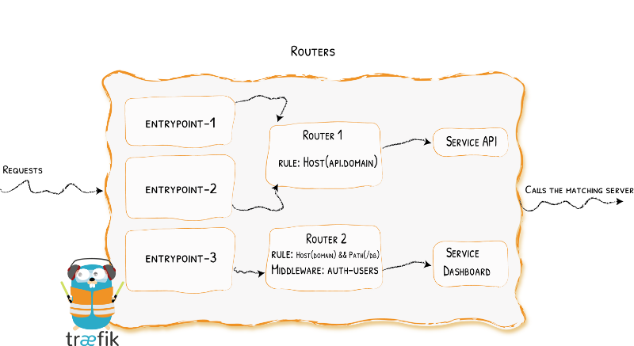

[Image Source](https://docs.traefik.io/assets/img/routers.png)

## Introduction

This tutorial is the second part of [this article](https://blog.containeroo.ch/2019/09/24/2019-09-24_traefik-2.0-docker-a-simple-step-by-step-guide/). We will go trough the following configurations:

1. Add a file provider to `traefik.yml`
2. Create a config file for a central configuration for storing middlewares `config.yml`.
3. Configure a middleware chain

You will find all the required configuration files in our Git [repository](https://github.com/containeroo/traefik-advanced).

## Prerequisites

In order to follow along, you'll need to read [this post](https://blog.containeroo.ch/2019/09/24/2019-09-24_traefik-2.0-docker-a-simple-step-by-step-guide/)!

## Update Traefik configuration

To setup a reusable middleware add an additional provider in the Traefik configuration file `traefik.yml` (`/opt/containers/traefik/traefik.yml`) (lines 15 and 16).

```yaml
api:
  dashboard: true
  debug: true

entryPoints:
  http:
    address: ":80"
  https:
    address: ":443"

providers:
  docker:
    endpoint: "unix:///var/run/docker.sock"
    exposedByDefault: false
  file:
    filename: /config.yml

certificatesResolvers:
  http:
    acme:
      email: email@example.com
      storage: acme.json
      httpChallenge:
        entryPoint: http
```

Create a file for the central configuration:

```bash
touch /opt/containers/traefik/data/config.yml
```

Add a middleware to redirect http to https (`/opt/containers/traefik/data/config.yml`):

```yaml
http:
  middlewares:
    https-redirect:
      redirectScheme:
        scheme: https
```

Mount the new `config.yml` file in the docker-compose file for Traefik (`/opt/containers/traefik/docker-compose.yml`) (line 20):

```yaml
version: "3"

services:
  traefik:
    image: traefik:v2.0
    container_name: traefik
    restart: unless-stopped
    security_opt:
      - no-new-privileges:true
    networks:
      - proxy
    ports:
      - 80:80
      - 443:443
    volumes:
      - /etc/localtime:/etc/localtime:ro
      - /var/run/docker.sock:/var/run/docker.sock:ro
      - ./data/traefik.yml:/traefik.yml:ro
      - ./data/acme.json:/acme.json
      - ./data/config.yml:/config.yml:ro
    labels:
      - "traefik.enable=true"
      - "traefik.http.routers.traefik.entrypoints=http"
      - "traefik.http.routers.traefik.rule=Host(`traefik.example.com`)"
      - "traefik.http.middlewares.traefik-auth.basicauth.users=USER:PASSWORD"
      - "traefik.http.middlewares.traefik-https-redirect.redirectscheme.scheme=https"
      - "traefik.http.routers.traefik.middlewares=traefik-https-redirect"
      - "traefik.http.routers.traefik-secure.entrypoints=https"
      - "traefik.http.routers.traefik-secure.rule=Host(`traefik.example.com`)"
      - "traefik.http.routers.traefik-secure.middlewares=traefik-auth"
      - "traefik.http.routers.traefik-secure.tls=true"
      - "traefik.http.routers.traefik-secure.tls.certresolver=http"
      - "traefik.http.routers.traefik-secure.service=api@internal"

networks:
  proxy:
    external: true
```

Recreate Traefik container:

```bash
docker-compose up -d
```

**Attention, Attention:**

The redirection in the file provider does not work in the docker-compose for Traefik!

## Use the new Middleware

As a template we use the docker-compose of Portainer from the [previous article](https://blog.containeroo.ch/2019/09/24/2019-09-24_traefik-2.0-docker-a-simple-step-by-step-guide/).
Replace the lines 19 and 20 with following line:

```yaml
- "traefik.http.routers.traefik.middlewares=https-redirect@file"
```

The Portainer docker-compose (`/opt/containers/portainer/docker-compose.yml`) now looks like this:

```yaml
version: "3"

services:
  portainer:
    image: portainer/portainer:latest
    container_name: portainer
    restart: unless-stopped
    security_opt:
      - no-new-privileges:true
    networks:
      - proxy
    volumes:
      - /etc/localtime:/etc/localtime:ro
      - /var/run/docker.sock:/var/run/docker.sock:ro
      - ./data:/data
    labels:
      - "traefik.enable=true"
      - "traefik.http.routers.portainer.entrypoints=http"
      - "traefik.http.routers.portainer.rule=Host(`portainer.example.com`)"
      - "traefik.http.routers.portainer.middlewares=https-redirect@file"
      - "traefik.http.routers.portainer-secure.entrypoints=https"
      - "traefik.http.routers.portainer-secure.rule=Host(`portainer.example.com`)"
      - "traefik.http.routers.portainer-secure.tls=true"
      - "traefik.http.routers.portainer-secure.tls.certresolver=http"
      - "traefik.http.routers.portainer-secure.service=portainer"
      - "traefik.http.services.portainer.loadbalancer.server.port=9000"
      - "traefik.docker.network=proxy"

networks:
  proxy:
    external: true
```

The `@file` instructs Traefik to look inside `config.yml` for the corresponding middleware.

So every time you want to redirect http to https, you can add the middleware `https-redirect`. You can add multiple middlewares separated with a comma.

## Middleware-Chain

The chain middleware enables you to define reusable combinations of other pieces of middleware. It makes reusing the same groups easier.

The description above was stolen from [here](https://docs.traefik.io/middlewares/chain/).

So let's do this! Add some middlewares in the `/opt/containers/traefik/data/config.yml`:

```yaml
http:
  middlewares:
    https-redirect:
      redirectScheme:
        scheme: https

    default-headers:
      headers:
        frameDeny: true
        sslRedirect: true
        browserXssFilter: true
        contentTypeNosniff: true
        forceSTSHeader: true
        stsIncludeSubdomains: true
        stsPreload: true

    default-whitelist:
      ipWhiteList:
        sourceRange:
          - "10.0.0.0/24"
          - "192.168.0.0/16"
          - "172.0.0.0/8"
```

- The `default-header` middleware sets some basic security headers.
- The `default-whitelist`middleware allows only internal IP addresses.

Then we add a middleware chain with the previously created middlewares:

```yaml
secured:
  chain:
    middlewares:
      - default-whitelist
      - default-headers
```

The complete `/opt/containers/traefik/data/config.yml` now looks like this:

```yaml
http:
  middlewares:
    https-redirect:
      redirectScheme:
        scheme: https

    default-headers:
      headers:
        frameDeny: true
        sslRedirect: true
        browserXssFilter: true
        contentTypeNosniff: true
        forceSTSHeader: true
        stsIncludeSubdomains: true
        stsPreload: true

    default-whitelist:
      ipWhiteList:
        sourceRange:
          - "10.0.0.0/24"
          - "192.168.0.0/16"
          - "172.0.0.0/8"

    secured:
      chain:
        middlewares:
          - default-whitelist
          - default-headers
```

To use the chain we can add it as any other middleware:

```yaml
- "traefik.http.routers.portainer-secure.middlewares=secured@file"
```

With the central middlewares and the middleware chain it's easy to setup multiple containers with the same configuration.

You can also add additional labels for the same settings. Here an example for Nextcloud:

```yaml
- "traefik.http.middlewares.nc-header.headers.customFrameOptionsValue=SAMEORIGIN"
- "traefik.http.routers.nextcloud-secure.middlewares=secured@file,nc-header"
```
