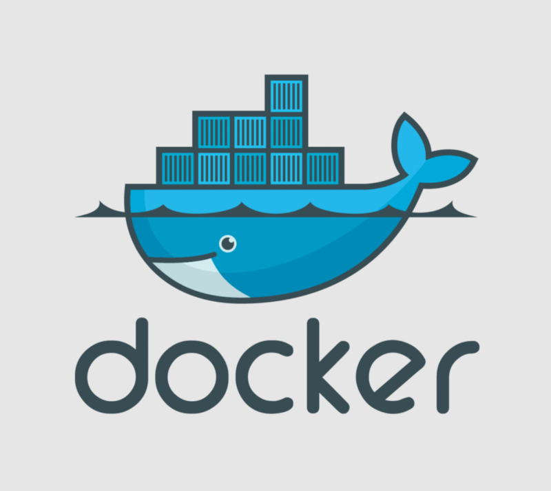

[Image Source](https://www.docker.com)

## The Problem

If you have followed our previous guides, you mount the Docker Socket ( `/var/run/docker.sock`) into the Traefik container. If someone gets access into the Traefik container, they can gain full access to your host machine. This makes our paranoia level increase slightly...

## The Solution

We found a nice little container ([Socket-Proxy](https://github.com/Tecnativa/docker-socket-proxy)) which "filters" all requests to the Docker API. We can allow only `get` requests to the Docker API and restrict it to `/containers/*`.

The Socket Proxy uses the official [Alpine](https://alpinelinux.org/)-based [HAProxy](http://www.haproxy.org/) image. It blocks access to the Docker socket API according to the environment variables you set. It returns a `HTTP 403 Forbidden` status for those dangerous requests that should never happen.

Let's create the socket-proxy container (`/opt/containers/docker-socket/docker-compose.yml`):

```yaml
version: "3.6"

services:
  socket-proxy:
    image: tecnativa/docker-socket-proxy
    container_name: socket-proxy
    restart: unless-stopped
    volumes:
      - /var/run/docker.sock:/var/run/docker.sock:ro
    environment:
      CONTAINERS: 1
    networks:
      - proxy

networks:
  proxy:
    external: true
```

The environment variable `CONTAINERS: 1` tells the proxy to grant `get` requests to `/containers/*` from the Docker API. `Post` requests are disabled by default.

All possible settings are described [here](https://github.com/Tecnativa/docker-socket-proxy#grant-or-revoke-access-to-certain-api-sections).

Now we have to change the endpoint in the providers section of the traefik.yml file (`/opt/containers/traefik/data/traefik.yml`):

```yaml
api:
  dashboard: true
  debug: false

entryPoints:
  http:
    address: ":80"
  https:
    address: ":443"

providers:
  docker:
    endpoint: "tcp://socket-proxy:2375"
    watch: true
    exposedbydefault: false
```

Restart the Traefik container and feel a little bit more safe!
