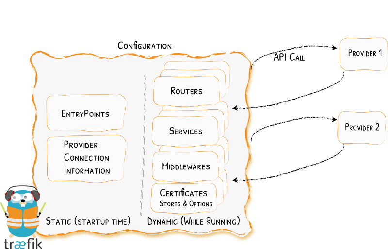

[Image Source](https://docs.traefik.io/assets/img/providers.png)

## Introduction

In this tutorial we will show you how you can route non-Docker services through Traefik.

Let's suppose you want to access your Pi-hole admin console (<http://192.168.0.10:80/admin>) by browsing to `pihole.example.com`.

## Prerequisites

You have read our other articles:

- [Traefik 2.0 + Docker: A Simple Step by Step Guide](https://blog.containeroo.ch/2019/09/24/2019-09-24_traefik-2.0-docker-a-simple-step-by-step-guide/)
- [Traefik 2.0 + Docker: An Advanced Guide](https://blog.containeroo.ch/2019/09/24/2019-09-24_traefik-2.0-docker-an-advanced-guide/)

and you use [this Traefik configuration](https://gist.github.com/containeroo-gists/866810758db56ea33a9c59390c18ea81).

Make sure you configure in the providers section of your `/opt/traefik/data/traefik.yml` an external configuration file `/config.yml`.

```yaml
providers:
  docker:
  endpoint: unix:///var/run/docker.sock
  exposedByDefault: false
  file:
    filename: /config.yml
```

## Setup config.yml

Edit `/opt/containers/traefik/data/config.yml` and create a new router `pihole`:

```yaml
http:
  routers:
    pihole:
      entryPoints:
        - https
      rule: Host(`pihole.example.com`)
      middlewares:
        - addprefix-pihole
      tls:
        certResolver: http
      service: pihole
```

Still in `/opt/containers/traefik/data/config.yml` create a service for the new router:

```yaml
services:
  pihole:
    loadBalancer:
      servers:
        - url: http://192.168.0.10:80
      passHostHeader: true
```

Because the admin panel of Pi-hole is only reachable at the path `/admin`, you have to create an additional middleware (also in `/opt/containers/traefik/data/config.yml`):

```yaml
middlewares:
  addprefix-pihole:
    addPrefix:
      prefix: /admin
```

If you have configured Traefik as we've described in the [advanced tutorial](https://blog.containeroo.ch/2019/09/24/2019-09-24_traefik-2.0-docker-an-advanced-guide/), your `config.yml` should now look like this:

```yaml
http:
  routers:
    pihole:
      entryPoints:
        - "https"
      rule: "Host(`pihole.example.com`)"
      middlewares:
        - default-headers
        - addprefix-pihole
      tls:
        certResolver: http
      service: pihole

  services:
    pihole:
      loadBalancer:
        servers:
          - url: "http://192.168.0.10:80"
        passHostHeader: true

  middlewares:
    addprefix-pihole:
      addPrefix:
        prefix: "/admin"

    https-redirect:
      redirectScheme:
        scheme: https

    default-headers:
      headers:
        frameDeny: true
        sslRedirect: true
        browserXssFilter: true
        contentTypeNosniff: true
        forceSTSHeader: true
        stsIncludeSubdomains: true
        stsPreload: true

    default-whitelist:
      ipWhiteList:
        sourceRange:
          - "10.0.0.0/24"
          - "192.168.0.0/16"
          - "172.0.0.0/8"

    secured:
      chain:
        middlewares:
          - default-whitelist
          - default-headers
```

We also added the middleware `default-headers` to the new `pihole` router.

Don't forget to restart Traefik `docker restart traefik` to reload the new `config.yml`!

### Wildcard certificates

If you use a wildcard certificate as described in [this article](https://blog.containeroo.ch/2019/11/12/2019-11-12_traefik-2.0-wildcard-lets-encrypt-certificates/), you must leave the `tls` section empty `{}`:

```yaml
http:
  routers:
    pihole:
      entryPoints:
        - https
      rule: Host(`pihole.example.com`)
      middlewares:
        - default-headers
        - addprefix-pihole
      tls: {}
      service: pihole
```

### Bonus example

Here you can find a complete `config.yml` to route a Synology Diskstation and Pi-hole through Traefik.

```yaml
http:
  routers:
    pihole:
      entryPoints:
        - "https"
      rule: "Host(`pihole.example.com`)"
      middlewares:
        - default-headers
        - addprefix-pihole
      tls:
        certResolver: http
      service: pihole

    synology:
      entryPoints:
        - "https"
      rule: "Host(`synology.example.com`)"
      middlewares:
        - default-headers
      tls:
        certResolver: http
      service: synology

  services:
    pihole:
      loadBalancer:
        servers:
          - url: "http://192.168.0.10:80"
        passHostHeader: true

    synology:
      loadBalancer:
        servers:
          - url: "http://192.168.0.11:5000"
        passHostHeader: true

  middlewares:
    addprefix-pihole:
      addPrefix:
        prefix: "/admin"

    https-redirect:
      redirectScheme:
        scheme: https

    default-headers:
      headers:
        frameDeny: true
        sslRedirect: true
        browserXssFilter: true
        contentTypeNosniff: true
        forceSTSHeader: true
        stsIncludeSubdomains: true
        stsPreload: true

    default-whitelist:
      ipWhiteList:
        sourceRange:
          - "10.0.0.0/24"
          - "192.168.0.0/16"
          - "172.0.0.0/8"

    secured:
      chain:
        middlewares:
          - default-whitelist
          - default-headers
```

As you can see, the Synology router has no extra middleware, because a Synology Disksation is accessible without any additional path.
