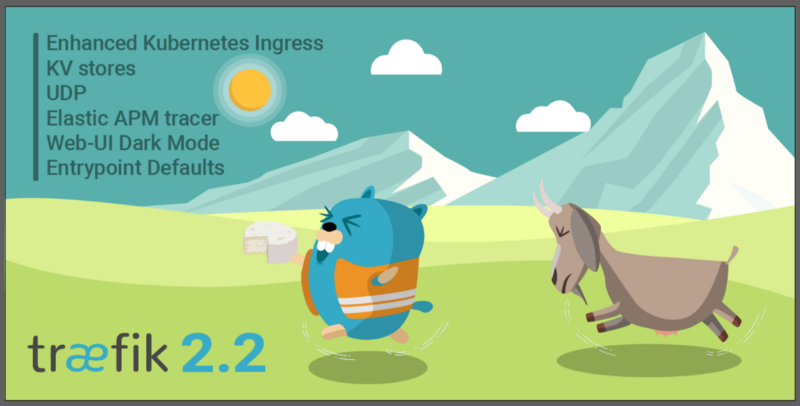

[Image Source](https://user-images.githubusercontent.com/5674651/76004307-90636980-5f09-11ea-9338-b3055d8b20ee.png)

## Introduction

With Traefik 2.2 it is now easier then ever to globally configure your entrypoints.

We will show you how you can define a global redirect to `https` and how to set a default `certResolver`. So you don't have to set the `https` redirect in each docker-compose file.

## Prerequisites

In order to follow along, you'll need to read [the advanced Traefik guide](https://blog.containeroo.ch/2019/09/24/2019-09-24_traefik-2.0-docker-an-advanced-guide/) and the [wildcard guide](https://blog.containeroo.ch/2019/11/12/2019-11-12_traefik-2.0-wildcard-lets-encrypt-certificates/) first!

## Update Traefik Configuration

Change the entrypoints in the basic Traefik configuration file (`/opt/containers/traefik/data/traefik.yml`) as follows:

```yaml
entryPoints:
  http:
    address: :80
    http:
      redirections:
        entryPoint:
          to: https
  https:
    address: :443
    http:
      middlewares:
        - default-headers@file
      tls:
        certResolver: cloudflare
        domains:
          - main: example.com
            sans:
              - "*.example.com"
```

The file will then look like this:

```yaml
api:
  dashboard: true
  debug: true

entryPoints:
  http:
    address: ":80"
    http:
      redirections:
        entryPoint:
          to: https
  https:
    address: ":443"
    http:
      middlewares:
        - default-headers@file
      tls:
        certResolver: cloudflare
        domains:
          - main: example.com
            sans:
              - "*.example.com"

providers:
  docker:
    endpoint: "unix:///var/run/docker.sock"
    exposedByDefault: false
  file:
    filename: /config.yml

certificatesResolvers:
  http:
    acme:
      email: email@email.com
      storage: acme.json
      httpChallenge:
        entryPoint: http
```

We added 2 things:

1. Global middleware `default-headers@file`

   By default all containers will now have the defined headers from the `/opt/containers/traefik/data/config.yml` created in the [advanced guide](https://blog.containeroo.ch/2019/09/24/2019-09-24_traefik-2.0-docker-an-advanced-guide/).

2. Global certResolver `cloudflare`

   Since we're using wildcard domains, you'll need to setup dns challenge first! If you get an error like this:

   ```console
   level=error msg=”middleware \”default-headers@file\” does not exist” routerName=traefik@docker entryPointName=https”
   ```

   Please make sure you have the middleware `default-headers` created in `/opt/containers/traefik/data/config.yml`. If not, either create it or remove the middleware from the traefik.yml.

Because we defined the `https` redirect and the `certResolver` here, you can remove some labels from all your docker-compose.

The Traefik docker-compose (`/opt/containers/traefik/docker-compose.yml`) now looks like this:

```yaml
version: "3"

services:
  traefik:
    image: traefik:v2.2
    container_name: traefik
    restart: unless-stopped
    security_opt:
      - no-new-privileges:true
    networks:
      - proxy
    ports:
      - 80:80
      - 443:443
    environment:
      - CF_API_EMAIL=your-cloudflare@email.com
      - CF_API_KEY=your-cloudflare-api-key
    volumes:
      - /etc/localtime:/etc/localtime:ro
      - /var/run/docker.sock:/var/run/docker.sock:ro
      - ./data/traefik.yml:/traefik.yml:ro
      - ./data/acme.json:/acme.json
    labels:
      - "traefik.enable=true"
      - "traefik.http.routers.traefik.entrypoints=https"
      - "traefik.http.routers.traefik.rule=Host(`traefik.example.com`)"
      - "traefik.http.middlewares.traefik-auth.basicauth.users=USER:PASSWORD"
      - "traefik.http.routers.traefik.middlewares=traefik-auth"
      - "traefik.http.routers.traefik.service=api@internal"

networks:
  proxy:
    external: true
```

The Portainer docker-compose (`/opt/containers/portainer/docker-compose.yml`) now looks like this:

```yaml
version: "3"

services:
  portainer:
    image: portainer/portainer:latest
    container_name: portainer
    restart: unless-stopped
    security_opt:
      - no-new-privileges:true
    networks:
      - proxy
    volumes:
      - /etc/localtime:/etc/localtime:ro
      - /var/run/docker.sock:/var/run/docker.sock:ro
      - ./data:/data
    labels:
      - "traefik.enable=true"
      - "traefik.http.routers.portainer.entrypoints=https"
      - "traefik.http.routers.portainer.rule=Host(`portainer.example.com`)"
      - "traefik.http.services.portainer.loadbalancer.server.port=9000"
      - "traefik.docker.network=proxy"

networks:
  proxy:
    external: true
```

As you can see, you only need 5 instead of 11 labels.

## Additional Individual Middlewares

If you want to add more individual middlewares, you can still add them to your docker-compose. In this example we've added a redirect regex required for Nextcloud (line 4, 5, 6 and 7):

```yaml
labels:
  - "traefik.enable=true"
  - "traefik.http.routers.nextcloud.rule=Host(`nextcloud.example.com`)"
  - "traefik.http.middlewares.nextcloud-redirectregex.redirectregex.regex=https://(.*)/.well-known/(card|cal)dav"
  - "traefik.http.middlewares.nextcloud-redirectregex.redirectregex.replacement=https://$$1/remote.php/dav/"
  - "traefik.http.middlewares.nextcloud-redirectregex.redirectregex.permanent=true"
  - "traefik.http.routers.nextcloud.middlewares=nextcloud-redirectregex"
  - "traefik.http.routers.nextcloud.service=nextcloud"
  - "traefik.http.services.nextcloud.loadbalancer.server.port=80"
  - "traefik.docker.network=proxy"
```
